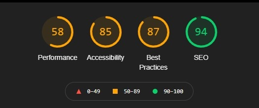
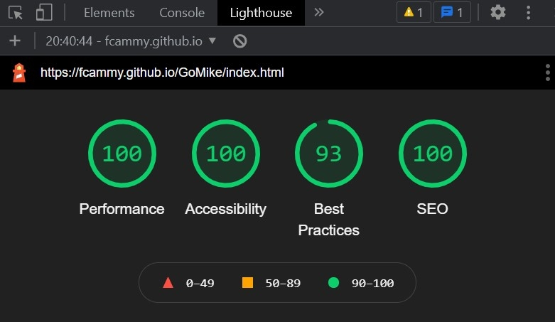

# GoMikeDesigns

Optimize an Existing Website by improving accessibility and SEO.

## Lighthouse score before optimization

## Lighthouse score after optimization

## Steps Taken
***
1. Added Title to all the pages to allow for better crawling and indexing.
2. Replace DIV tag with SEMANTIC tags to better structure the website.
3. Compressed and optimised images to speed up site loading time.
4. Used the mobile accessibility checklist to make the website accessible to everyone.
5. Remove unused Javascript and CSS files.
6. Followed Chrome Lighthouse recommendation to optimise the website.
